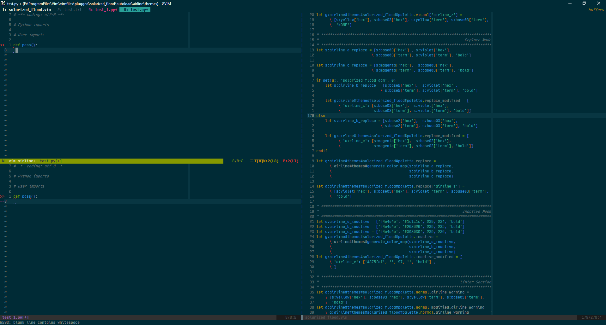

# solarized_flood
A colorscheme for lightline/vim-airline. Lets make the solarized flood fill your Vim.




## Table Of Contents

- [Installation](#installation)
- [Configuration](#configuration)
- [License](#license)

## Installation

The following example it based on [vim-plug](https://github.com/junegunn/vim-plug).

The `master` branch is for [lightline](https://github.com/itchyny/lightline.vim).

```vim
Plug 'Neur1n/solarized_flood'
```

To install this colorscheme for [vim-airline](https://github.com/vim-airline/vim-airline),
one may use:

```vim
Plug 'Neur1n/solarized_flood', {'branch': 'vim-airline'}
```

## Configuration

##### `g:solarized_flood_nv_mode_style`
An option to customize the font style of seciton c when in normal and visual
mode, since the 'italic' style sometimes causes glitches on the statusline.
The default is:

```vim
let g:solarized_flood_nv_mode_style = 'NONE'
```

More styles can be found with ':help attr-list'.

##### `g:solarized_flood_dam`
Now lets bulid a dam to stop the flood! The default highlighting for 'modified'
mode could be inconspicuous that one should actually move an eye on the
statusline to tell if a buffer is modified. Enabling the 'dam' will inverse the
highlighting and the whole section c will be highlighted which makes it more
obivous after a buffer is modified. To enable it:

```vim
let g:solarized_flood_dam = 1 (default: 0)
```

## License

Released under the [MIT License](LICENSE)
